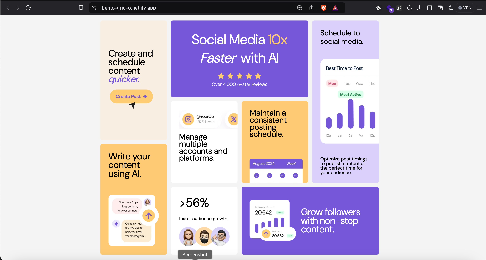

# Bento grid - Frontend Mentor - 

This is a solution to the [Bento grid challenge on Frontend Mentor](https://www.frontendmentor.io/challenges/bento-grid-RMydElrlOj). 

## Table of contents

- [Overview](#overview)
  - [The challenge](#the-challenge)
  - [Screenshot](#screenshot)
  - [Links](#links)
- [My process](#my-process)
  - [Built with](#built-with)
  - [What I learned](#what-i-learned)
- [Author](#author)
- [Acknowledgments](#acknowledgments)

## Overview

### The challenge

Users should be able to:

- View the optimal layout for the interface depending on their device's screen size

### Screenshot




### Links

- Live Site URL: [Visit live site](https://bento-grid-o.netlify.app/)

- Solution URL: [Frontend Mentor Solution Link](https://www.frontendmentor.io/solutions/bento-grid-with-html-and-css-HUVHZ66f33)


## My process

### Built with

- Semantic HTML5 markup
- CSS custom properties
- CSS Grid


### What I learned

- CSS grid-template-areas and grid-area

```css
.bento_grid {
  
  grid-template-areas:
    "scheduleQuicker hero hero schedule"
    "scheduleQuicker hero hero schedule"
    "scheduleQuicker multipleAccounts consistentPosting schedule"
    "aiwriting multipleAccounts consistentPosting schedule"
    "aiwriting fasterAudienceGrowth growFollowers growFollowers"
    "aiwriting fasterAudienceGrowth growFollowers growFollowers";
}

.bento_item_1 {
  grid-area: hero;
}

```

## Author

- Website - [Osaro Iyoha](https://osaro.vercel.app/)
- Frontend Mentor - [@osaaroh](https://www.frontendmentor.io/profile/osaaroh)


Check out [The Markdown Guide](https://www.markdownguide.org/) to learn more about markdown.


